# GameOn — Projektna Dokumentacija

> **GameOn** je platforma za organizacijo in upravljanje rekreativnih športnih tekem (futsal, košarka) v Sloveniji. Sestavljena je iz mobilne aplikacije za igralce ter spletne aplikacije za lastnike športnih objektov.

---

## Kazalo

1. [Opis projekta](#opis-projekta)
2. [Arhitektura sistema](#arhitektura-sistema)
3. [Tehnološki sklad](#tehnološki-sklad)
4. [Podatkovni modeli — ER diagram](#podatkovni-modeli--er-diagram)
5. [Razredni diagram](#razredni-diagram)
6. [Diagram primerov uporabe](#diagram-primerov-uporabe)
7. [Sekvenčni diagrami](#sekvenčni-diagrami)
8. [Navigacijska struktura](#navigacijska-struktura)
9. [Ključne funkcionalnosti](#ključne-funkcionalnosti)
10. [Navodila za zagon](#navodila-za-zagon)
11. [Vodenje projekta](#vodenje-projekta)
12. [Zagotavljanje kakovosti](#zagotavljanje-kakovosti)
13. [Varnostna pravila](#varnostna-pravila)

---

## Opis projekta

GameOn je hibridna platforma, ki rešuje dve povezani težavi rekreativnega športa.

**Za igralce.** Rekreativne tekme v futsalu in košarki se organizirajo neformalno — prek klepetalnic, kjer se izgubi pregled nad tem, kdo pride, kdo dolguje najemnino in kdo se redno ne pojavi. GameOn to prestavi v aplikacijo: tekme so vidne na zemljevidu, prijava je z enim klikom, sistem pa sam vodi zasedenost, čakalno listo in delitev stroškov najema.

**Za lastnike objektov.** Dvorane in igrišča se rezervirajo po telefonu, urnik pa se vodi ročno. Spletna konzola lastniku omogoča, da objavi tedenski urnik s cenami, sprejema rezervacije, ki nastanejo neposredno iz tekem, in spremlja prihodke.

### Kaj platformo loči od navadnega koledarja

| Mehanizem | Zakaj obstaja |
|---|---|
| **ELO ocena** | Rekreativne tekme so pogosto neuravnotežene. Vsak igralec ima oceno moči (začetna 700), ki se po tekmi posodobi glede na rezultat in moč nasprotnika. |
| **Uravnoteženje ekip** | Sistem razdeli prijavljene v dve ekipi po ELO in igralnih pozicijah, da tekma ostane tekmovalna. |
| **Reputacija** | Neudeležba pokvari tekmo vsem. Prisotnost dvigne reputacijo (+2), neopravičena odsotnost jo zniža (−5); igralce z nizko reputacijo je mogoče izločiti iz povabil. |
| **Soglasje kapetanov** | Rezultata ne vpisuje ena oseba. Sistem določi kapetana obeh ekip; ELO se razdeli šele, ko se njuna vnosa ujemata, sicer odloča večina igralcev. |
| **Značke** | Dolgoročna motivacija — odklepajo se ob mejnikih (število tekem, zmage, ELO, reputacija). |

### Ciljni uporabniki

| Tip | Platforma | Vloga |
|-----|-----------|-------|
| Igralec | Mobilna aplikacija (Android) | Išče, ustvarja in se pridružuje tekmam |
| Gostitelj | Mobilna aplikacija | Igralec, ki je ustvaril tekmo — ureja ekipi, vabi igralce, začne tekmo |
| Kapetan ekipe | Mobilna aplikacija | Igralec z najvišjim ELO v ekipi — vnese končni rezultat |
| Lastnik objekta | Spletna aplikacija | Upravlja prostore, razporede in rezervacije |
| Administrator | Firebase konzola | Nadzoruje sistem |

Gostitelj in kapetan nista ločena računa, temveč vlogi, ki ju igralec dobi v okviru posamezne tekme.

---

## Arhitektura sistema

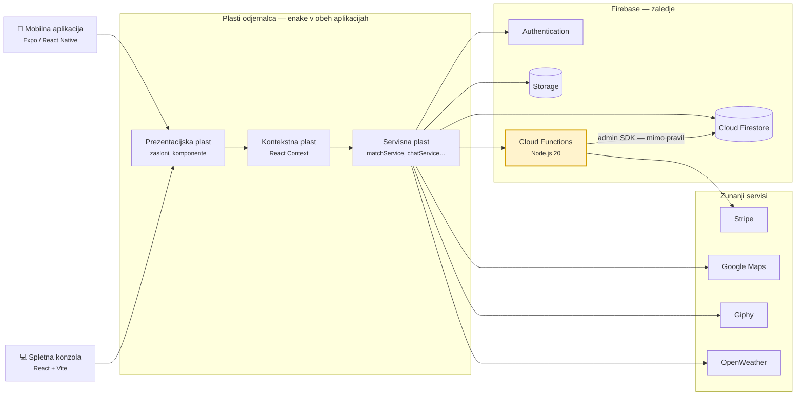

**Kako beremo diagram.** Tok gre z leve proti desni: odjemalca (mobilna aplikacija in spletna konzola) → notranje plasti → Firebase → zunanje storitve.

Obe aplikaciji imata enako trislojno zgradbo, zato je narisana enkrat. Zaslon nikoli ne kliče baze neposredno — klic gre skozi kontekstno in nato servisno plast, ki je edina točka stika z zaledjem. Iz servisne plasti vodijo štiri povezave v Firebase (prijava v *Authentication*, branje in pisanje v *Firestore*, slike klepeta v *Storage*, klic funkcije v *Cloud Functions*) in tri k zunanjim storitvam (zemljevid, GIF-i, vreme).

Rumeno obarvana **Cloud Functions** je edina komponenta, ki v Firestore piše z admin SDK. Ta pot varnostna pravila v celoti obide, zato je tam edino mesto, kjer smejo nastati rezultat tekme, ELO in reputacija. Stripe se kliče izključno od tod, da skrivni ključ nikoli ne pride v odjemalca.

Firebase Hosting v diagramu ni narisan kot povezava, ker ne gre za klic med plastmi — Hosting samo dostavi zgrajeno spletno konzolo v brskalnik.

### Opis arhitekturnih plasti

| Plast | Kje živi | Odgovornost | Zakaj je ločena |
|---|---|---|---|
| **Prezentacijska** | `src/screens/`, `src/components/`, `src/pages/` | Izris vmesnika in obravnava dotikov/klikov | Zasloni ostanejo brez poslovne logike, zato jih je mogoče spremeniti brez tveganja za podatke |
| **Kontekstna** | `src/context/` | Globalno stanje: prijavljeni uporabnik, premium status, barvna tema | Prepreči podajanje istih podatkov skozi več nivojev komponent |
| **Servisna** | `src/services/` | Vsi klici do Firestore, Storage in Cloud Functions; pretvorba podatkov | Ena sama točka dostopa do podatkov — sprememba sheme se popravi na enem mestu |
| **Podatkovna** | Cloud Firestore, Firebase Storage | Trajno shranjevanje dokumentov in datotek | — |
| **Funkcijska** | `functions/index.js` | Logika, ki ji odjemalec ne sme biti zaupana: soglasje o rezultatu, razdelitev ELO, Stripe seje | Odjemalec je v rokah uporabnika in ga je mogoče spremeniti; strežniška koda ne |

**Zakaj je logika rezultata na strežniku.** Če bi ELO računal telefon, bi lahko kdor koli s spremenjenim odjemalcem zapisal poljubno oceno. Zato Cloud Function `submitMatchScore` v eni transakciji preveri, kdo je kapetan, ali se vnosa ujemata, izračuna ELO in zapre tekmo — varnostna pravila pa odjemalcu ta polja izrecno prepovedujejo (glej [Varnostna pravila](#varnostna-pravila)).

---

## Tehnološki sklad

### Mobilna aplikacija

| Tehnologija | Verzija | Namen | Zakaj ta izbira |
|---|---|---|---|
| React Native | 0.74.5 | UI ogrodje | Ena koda za Android in iOS; ekipa že obvlada React |
| Expo | ~51.0.28 | Razvojno in build ogrodje | Odpravi ročno nastavljanje Android/iOS projektov; `expo-location`, `expo-notifications` in `expo-image-picker` delujejo brez pisanja domorodne kode |
| React Navigation | 6.x | Navigacija (Drawer + Stack) | Standard v RN; podpira gnezdene navigatorje, ki jih zahteva struktura aplikacije |
| Firebase SDK | 10.13.1 | Zaledna integracija | `onSnapshot` omogoča živo osveževanje tekem in klepeta brez lastnega strežnika |
| Stripe React Native | 0.37.2 | Plačila | Podatki o kartici ne gredo nikoli skozi našo kodo — zmanjša odgovornost glede PCI |
| react-native-maps | — | Prikaz zemljevida | Domorodni zemljevid, tekoč tudi pri večjem številu označb |
| expo-location | — | GPS lokacija | Iskanje tekem v bližini |
| expo-notifications | — | Potisna obvestila | Obveščanje o povabilih, začetku tekme in odpovedi |
| expo-image-picker | — | Nalaganje slik | Slike v klepetu tekme |

### Spletna aplikacija

| Tehnologija | Verzija | Namen | Zakaj ta izbira |
|---|---|---|---|
| React | 18.3.1 | UI ogrodje | Enak miselni model kot mobilna aplikacija |
| TypeScript | 5.6.2 | Tipizacija | `strict: true` — napake v obliki podatkov se ujamejo pri prevajanju, ne pri uporabniku |
| Vite | 5.4.8 | Build orodje | Bistveno hitrejši razvojni strežnik od Webpacka |
| React Router DOM | 6.26.2 | Usmerjanje | Zaščitene poti za razdelke, dostopne samo lastnikom |
| Tailwind CSS | 3.4.13 | Stilizacija | Doslednost brez vzdrževanja ločenih CSS datotek |
| Leaflet | — | Interaktivni zemljevid | Odprtokoden, brez ključa in stroška — za izbiro lokacije objekta zadošča |
| Firebase SDK | 11.1.0 | Zaledna integracija | Ista baza kot mobilna aplikacija |

### Backend

| Tehnologija | Namen | Zakaj ta izbira |
|---|---|---|
| Firebase Authentication | Prijava in registracija (e-pošta + geslo) | Gesla nikoli ne pridejo v našo bazo; `request.auth.uid` je neposredno uporaben v varnostnih pravilih |
| Cloud Firestore | Glavna NoSQL baza | Živi poslušalci (`onSnapshot`) in varnostna pravila na strani strežnika — brez lastnega API strežnika |
| Firebase Storage | Slike in datoteke | Slike v klepetu; naložene mimo Firestore, ki ima omejitev 1 MB na dokument |
| Cloud Functions (Node.js 20) | Zaupanja vredna logika | Soglasje kapetanov, izračun ELO, ustvarjanje kapetanov, Stripe seje |
| Firebase Hosting | Gostovanje spletne konzole | Vključen HTTPS in CDN |
| Stripe | Plačilni prehod | Skrbniški ključ ostane v okolju funkcij, nikoli v odjemalcu |

**Zakaj Firestore in ne relacijska baza.** Tekma je v praksi en dokument, ki ga aplikacija bere v celoti — igralci, ekipi, rezultat in stanje so v istem zapisu, zato ni potrebe po združevanju tabel. Živi poslušalci pomenijo, da se prijava soigralca prikaže vsem takoj, brez poizvedovanja v zanki. Ceno tega plačamo pri poizvedbah, ki bi v SQL bile trivialne (npr. seštevek prihodkov po objektih), zato jih izračunamo v odjemalcu.

**Kje so meje te izbire.** Firestore ne pozna transakcij prek več kolekcij brez branja vseh dokumentov vnaprej, zato je razdelitev ELO napisana tako, da se vsa branja zgodijo pred pisanji. Prav tako ni polnotekstnega iskanja — iskanje igralcev za povabilo zato deluje na podlagi ELO razpona in pozicije, ne po imenu.

---

## Podatkovni modeli — ER diagram

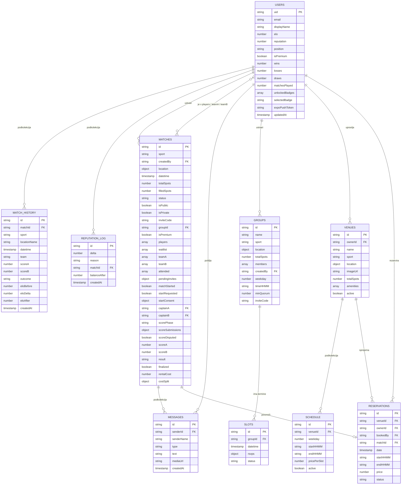

**Kako beremo diagram.** Vsak pravokotnik je Firestore kolekcija, ne SQL tabela — razlika je bistvena. Firestore nima vezanih ključev; oznaka `FK` tu pomeni le, da polje hrani `id` dokumenta iz druge kolekcije, povezavo pa vzdržuje aplikacija.

Opazna posebnost je, da **sodelovanje na tekmi ni ločena kolekcija**. Namesto vezne tabele so igralci shranjeni kar v poljih tipa seznam na dokumentu tekme (`players`, `waitlist`, `teamA`, `teamB`, `attended`). Zato je razmerje med uporabniki in tekmami narisano kot *več proti več* neposredno. Prednost je, da aplikacija z enim branjem dobi celotno stanje tekme; slabost, da poizvedba »vse tekme tega igralca« potrebuje indeks `array-contains` in da je velikost dokumenta omejena na 1 MB.

Enako velja za **soglasje o rezultatu**: `scoreSubmissions` je preslikava `uid → { scoreA, scoreB, submittedAt }` znotraj dokumenta tekme, ne samostojna kolekcija. Tako lahko Cloud Function v eni transakciji prebere vse oddane rezultate, ugotovi večino in zaključi tekmo.

### Kolekcije v Firestore

| Pot | Vsebina | Kdo piše |
|---|---|---|
| `users/{uid}` | Profil: ELO, reputacija, pozicija, statistika, značke | Lastnik računa; ELO in statistiko po tekmi Cloud Function |
| `users/{uid}/matchHistory/{id}` | Zapis o odigrani tekmi z ELO pred/po | samo Cloud Function |
| `users/{uid}/reputationLog/{id}` | Dnevnik sprememb reputacije | Cloud Function in odjemalec (odjava s tekme) |
| `matches/{id}` | Tekma: udeleženci, ekipi, stanje, rezultat | Odjemalec (prijave, ekipi); rezultat in zaključek samo Cloud Function |
| `matches/{id}/messages/{id}` | Klepet tekme | Prijavljeni igralci tekme |
| `groups/{id}` | Ponavljajoča se skupina (tedenski termin) | Ustvarjalec skupine |
| `slots/{id}` | Posamezen termin skupine z RSVP odgovori | Člani skupine |
| `venues/{id}` | Športni objekt | Lastnik objekta |
| `venues/{id}/schedule/{id}` | Tedenski urnik in cenik objekta | Lastnik objekta |
| `reservations/{id}` | Rezervacija termina | Mobilna aplikacija ustvari; lastnik in rezervator posodabljata |

> **Opozorilo.** Kolekciji `groups` in `slots` sta v uporabi, a zanju v `firestore.rules` **ni zapisanega pravila**. Firestore privzeto zavrne vse, kar ni izrecno dovoljeno, zato ponavljajoče se skupine v produkciji ne delujejo. Podrobneje v razdelku [Varnostna pravila](#varnostna-pravila).

---

## Razredni diagram

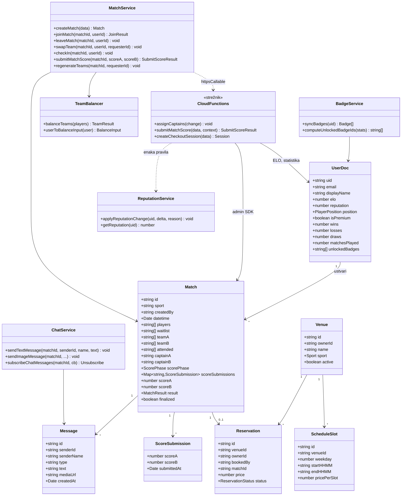

**Kako beremo diagram.** Zgornji del so podatkovni tipi, spodnji pa servisi, ki z njimi delajo. Ključna je črtkana povezava `MatchService ..> CloudFunctions`: mobilna aplikacija končnega rezultata **ne zapiše sama**, temveč prek `httpsCallable` pokliče strežniško funkcijo. Razred `CloudFunctions` je označen s stereotipom `<<strežnik>>`, ker edini piše polja rezultata in ELO — do `Match` in `UserDoc` dostopa z admin SDK in tako obide varnostna pravila.

`ScoreSubmission` ni samostojna kolekcija, temveč vgnezdena struktura znotraj dokumenta tekme — od tod razmerje `Match "1" --> "*" ScoreSubmission`.

Za primerjavo s prejšnjo različico dokumentacije: razreda `MatchScoring` ter metod `closeMatch()` in `updateElo()` ni več. Zamenjala jih je pot `submitMatchScore` → soglasje → samodejni zaključek, opisana v [sekvenčnem diagramu](#zaključek-tekme--soglasje-kapetanov-in-razdelitev-elo).

---

## Diagram primerov uporabe


> Diagram je izdelan v **Visual Paradigm** (standardna UML notacija).
> Izvorni projekt za urejanje: [`docs/diagrami/projekt.vpp`](docs/diagrami/projekt.vpp) —
> po spremembi diagram znova izvozi kot sliko (*File → Export → Active Diagram as Image*).

**Branje diagrama**

| Element | Pomen |
|---|---|
| Palični lik | Akter (uporabnik ali zunanji sistem) |
| Oval | Primer uporabe |
| Modri pravokotnik | Meja sistema |
| Polna črta brez puščice | Asociacija med akterjem in primerom uporabe |
| Puščica s praznim trikotnikom | Generalizacija akterja (kaže od specializiranega k splošnemu) |
| `<<Include>>` | Osnovni primer uporabe vedno vključuje drugega |
| `<<Extend>>` | Razširitev, ki se izvede le pod določenim pogojem |
| *extension points* | Točka v osnovnem primeru uporabe, kjer se razširitev vključi |

**Vloge**

- **Gostitelj / Ustvarjalec tekme** in **Kapetan ekipe** sta specializaciji **Igralca** — podedujeta vse njegove primere uporabe in dodata svoje.
- **Kapetan** ni ročna vloga: ob začetku tekme ga sistem samodejno dodeli igralcu z najvišjim ELO v vsaki ekipi (Cloud Function `assignCaptains`).
- **Stripe** je zunanji akter — sodeluje samo pri plačilu najema igrišča.

**Postopek zaključka tekme**

- *Oddaj končni rezultat* **vključuje** (`<<Include>>`) *Zaključi tekmo in razdeli ELO / reputacijo*: ko se rezultata obeh kapetanov ujemata, se tekma samodejno zapre in ELO ter reputacija se razdelita vsem prisotnim igralcem.
- *Vnos rezultata ob neujemanju kapetanov* **razširja** (`<<Extend>>`) oddajo rezultata: sproži se samo, če se kapetana ne strinjata, in je takrat na voljo vsem prijavljenim igralcem — velja rezultat večine.

---

## Sekvenčni diagrami

### Pridružitev tekmi

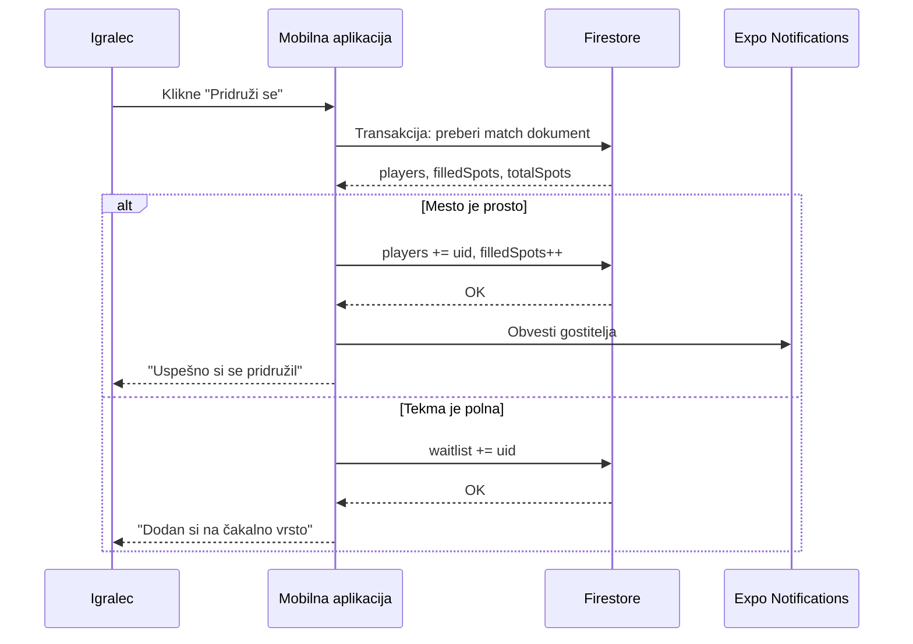

**Kaj se dogaja.** Branje in pisanje sta v isti Firestore transakciji, ker se lahko dva igralca prijavita hkrati na zadnje prosto mesto. Brez transakcije bi oba prebrala `filledSpots = 9` in oba zapisala `10`, tekma pa bi imela enega igralca preveč. Transakcija drugi zahtevi zazna spremembo in jo ponovi, zato se drugi igralec pravilno uvrsti na čakalno listo.

### Zaključek tekme — soglasje kapetanov in razdelitev ELO

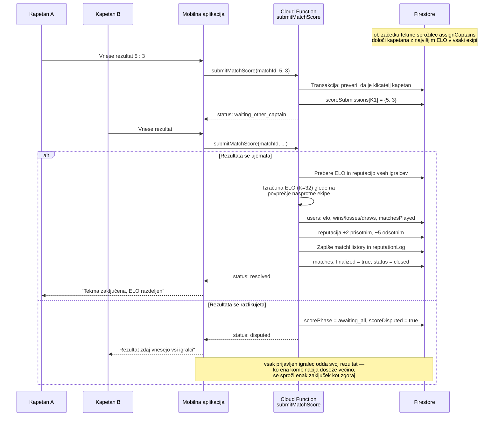

**Kaj se dogaja.** Rezultat ni več seštevek posamičnih golov, ki bi jih med tekmo vpisovali igralci — namesto tega tekma dobi končni izid šele po odigranem srečanju, in sicer s soglasjem.

Ob začetku tekme sprožilec `assignCaptains` prebere ELO vseh igralcev in za vsako ekipo določi kapetana. Vsak kapetan nato vnese končni rezultat. Če se vnosa ujemata, se tekma takoj zapre in ELO se razdeli. Če se razlikujeta, se vnos odpre vsem prijavljenim igralcem in obvelja rezultat, ki doseže večino.

Celotna logika teče v **eni Firestore transakciji znotraj Cloud Function**, ne v aplikaciji. Razlog je varnostni: če bi ELO računal telefon, bi lahko kdor koli s spremenjenim odjemalcem zapisal poljubno oceno. Varnostna pravila zato odjemalcu izrecno prepovedujejo pisanje polj `scoreA`, `scoreB`, `result`, `finalized`, `captainA`, `captainB`, `scorePhase`, `scoreSubmissions` in `scoreDisputed`; Cloud Function jih sme pisati, ker admin SDK varnostna pravila obide.

ELO se izračuna po standardni formuli s faktorjem **K = 32**, pri čemer se igralca primerja s **povprečnim ELO nasprotne ekipe**. Spremembo dobijo samo igralci, ki so označeni v `attended` — kdor se ni pojavil, ELO ohrani, izgubi pa 5 točk reputacije.

### Uravnoteženje ekip

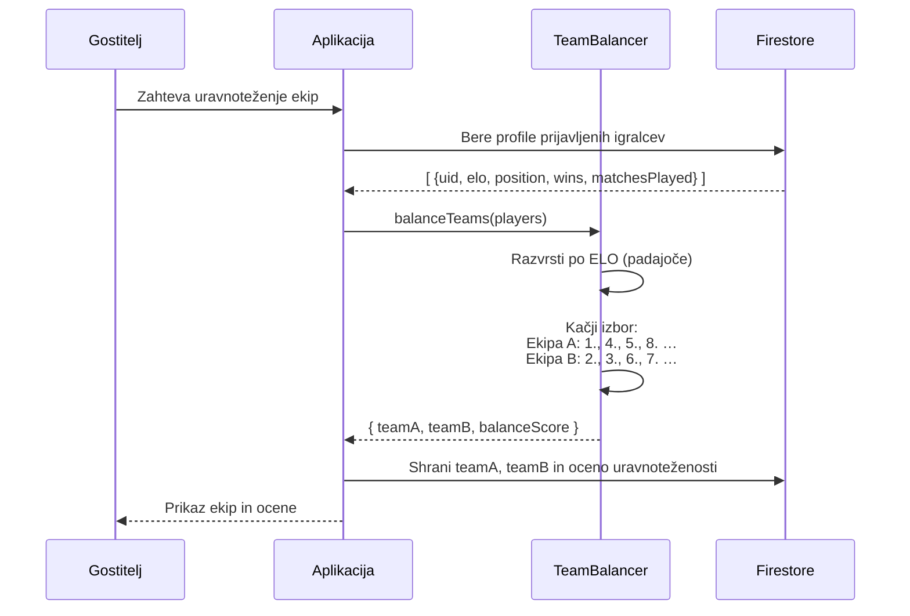

**Kaj se dogaja.** Igralci se razvrstijo po ELO, nato pa se razdelijo po načelu *kačjega izbora* (snake draft): najmočnejši gre v ekipo A, naslednja dva v ekipo B, nato spet dva v A in tako naprej. Preprosto izmenjavanje ena-za-drugo bi ekipi A vedno dalo najmočnejšega igralca v vsakem paru, kačji izbor pa to prednost izniči.

Rezultat je `balanceScore` — ocena od 0 do 100, ki upošteva razliko povprečnega ELO in pokritost igralnih pozicij. Postopek teče v odjemalcu, ker gre le za predlog razporeditve: gostitelj ga lahko ročno popravi, dokler se tekma ne začne. Po začetku tekme je menjava ekip onemogočena, sicer bi lahko kapetan po določitvi prestopil v drugo ekipo.

---

## Navigacijska struktura

### Mobilna aplikacija

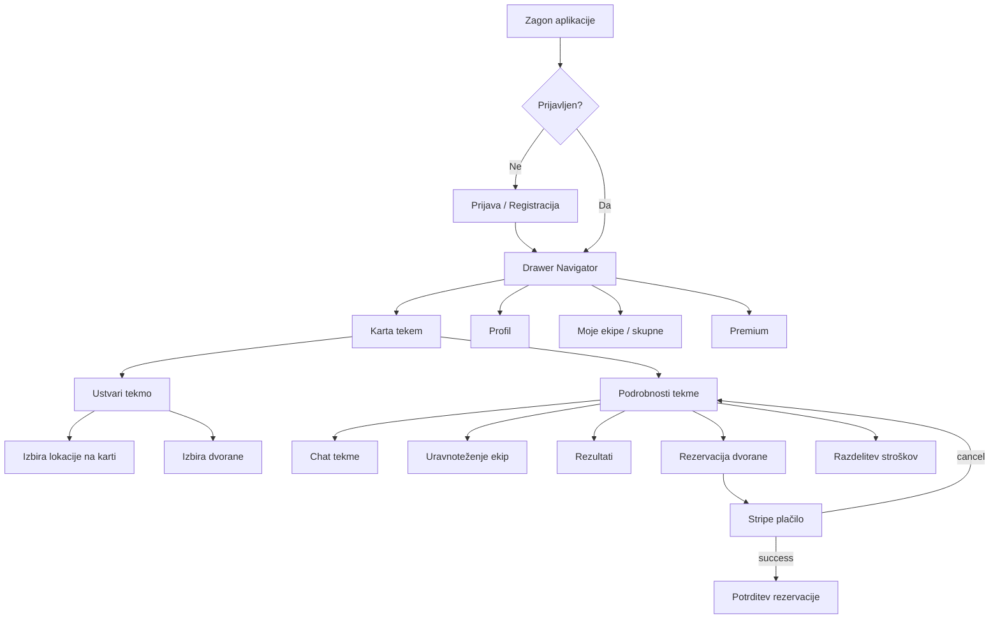

**Kako beremo diagram.** Diagram prikazuje, katere zaslone doseže uporabnik in prek katerih odločitev. Vstopna točka je preverjanje prijave: neprijavljeni uporabnik vidi samo prijavni zaslon. Po prijavi je osnovna struktura Drawer navigator (stranski meni), znotraj katerega je Stack navigator za poglabljanje v posamezno tekmo. Zato je z zaslona s podrobnostmi tekme mogoče iti nazaj na seznam, ne da bi se izgubil stranski meni.

### Spletna aplikacija (lastnik objekta)

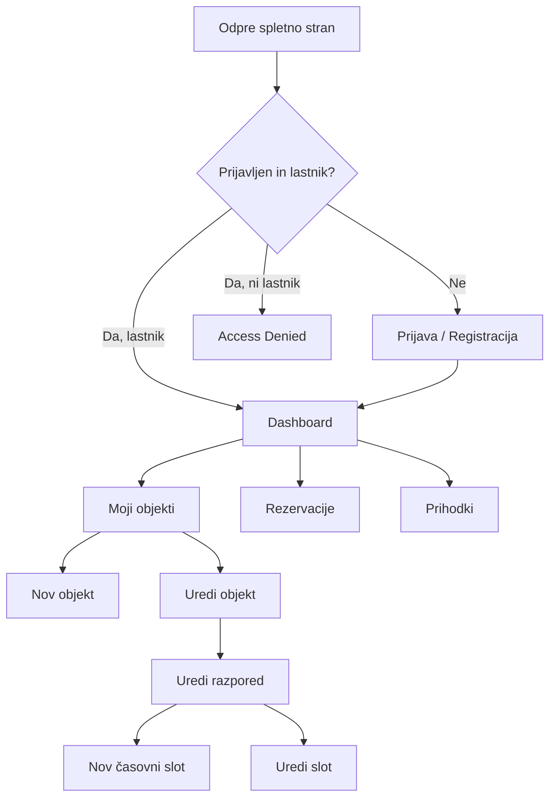

**Kako beremo diagram.** Spletna konzola ima dvojno preverjanje: poleg prijave se preveri še, ali ima uporabnik vlogo lastnika. Igralec, ki bi se prijavil s svojim računom, konča na zaslonu *Access Denied* — konzola namreč ni namenjena igralcem. Vse nadaljnje poti izhajajo iz nadzorne plošče.

---

## Ključne funkcionalnosti

### 1. Sistem ELO ocenjevanja

Vsak igralec ima ELO oceno (začetna vrednost **700**), ki se posodobi po zaključku tekme. Uporabljena je standardna ELO formula, pri čemer se posameznik primerja s **povprečnim ELO nasprotne ekipe**:

```
E_A      = 1 / (1 + 10^((ELO_nasprotniki - ELO_igralec) / 400))
Nova_ELO = Stara_ELO + K * (dejanski_rezultat - E_A)
K        = 32
dejanski_rezultat:  zmaga = 1,  neodločeno = 0.5,  poraz = 0
```

Sprememba se izračuna **samo za igralce, označene kot prisotne** (polje `attended`). Kdor se ni pojavil, ELO ohrani nespremenjen, izgubi pa 5 točk reputacije.

Izračun teče izključno v Cloud Function `submitMatchScore`, in sicer šele takrat, ko je rezultat potrjen s soglasjem kapetanov — ali z večino igralcev, če se kapetana ne strinjata. Varnostna pravila odjemalcu prepovedujejo pisanje polj rezultata, zato ELO ni mogoče pridobiti mimo tega postopka.

> **Sprememba glede na prejšnjo različico.** Nekdanji bonus **+5 ELO za vsak dosežen gol** je odstranjen. Sistem med tekmo ne beleži več posameznih golov in strelcev, temveč samo končni izid, zato ELO odraža izključno rezultat tekme in moč nasprotnika.

### 2. Sistem reputacije

| Dogodek | Sprememba |
|---------|-----------|
| Udeležba na tekmi | +2 |
| Odjava pravočasno | 0 |
| Pozna odjava (< 2 uri pred tekmo) | -2 |
| Neupravičena odsotnost | -5 |

Reputacija je omejena med 0 in 100, začetna vrednost je **50**.

### 3. Uravnoteženje ekip (Snake Draft)

Algoritem razporedi igralce v dve enakovredni ekipi:
1. Razvrsti vse prijavljene po moči (ELO + pozicija)
2. Uporabi snake draft: A, B, B, A, A, B, B, A ...
3. Upošteva pozicije (vratar, branilec, vezni, napadalec / bek, center, krilo)

### 4. Premium tier

Premium člani imajo dostop do:
- Ekskluzivnih premium tekem
- Naprednih statistik (ELO trend, win rate)
- Premium badge na profilu
- Prednostnega dostopa do rezervacij

### 5. Živahni chat z medijsko vsebino

Vsaka tekma ima lasten chat kanal v realnem času (Firestore `onSnapshot`):
- Besedilna sporočila
- Slike (nalaganje v Firebase Storage)
- GIF-i (Giphy API integracija)

### 6. Integracija s Stripe

Plačila za rezervacije dvorane tečejo prek **Stripe Checkout**:
1. Cloud Function ustvari Stripe Checkout Session
2. Aplikacija odpre Stripe URL v brskalniku
3. Po uspešnem plačilu se aplikacija vrne na potrdilno stran
4. Rezervacija se potrdi v Firestore

---

## Navodila za zagon

### Predpogoji

- Node.js 20+
- Expo CLI: `npm install -g expo-cli`
- Firebase CLI: `npm install -g firebase-tools`
- Android Studio / Expo Go app (za mobilno)

### 1. Kloniranje repozitorija

```bash
git clone https://github.com/ninolisjak/gameon_projekt.git
cd gameon_projekt
```

### 2. Zagon mobilne aplikacije

```bash
cd mobile
npm install
npx expo start
```

Odprite Expo Go na telefonu in skenirajte QR kodo **ali** zaženite Android emulator.

### 3. Zagon spletne aplikacije

```bash
cd web
npm install
npm run dev
```

Dostopno na: `http://localhost:5173`

### 4. Zagon Cloud Functions (lokalno)

```bash
cd functions
npm install
firebase emulators:start
```

### Firebase konfiguracija

Ustvarite `mobile/src/config/firebase.ts` in `web/src/config/firebase.ts` z Firebase konfiguracijskimi podatki iz Firebase konzole:

```typescript
const firebaseConfig = {
  apiKey: "...",
  authDomain: "gameon-9d876.firebaseapp.com",
  projectId: "gameon-9d876",
  storageBucket: "gameon-9d876.appspot.com",
  messagingSenderId: "...",
  appId: "..."
};
```

---

## Vodenje projekta

### Struktura vej (Git Flow)

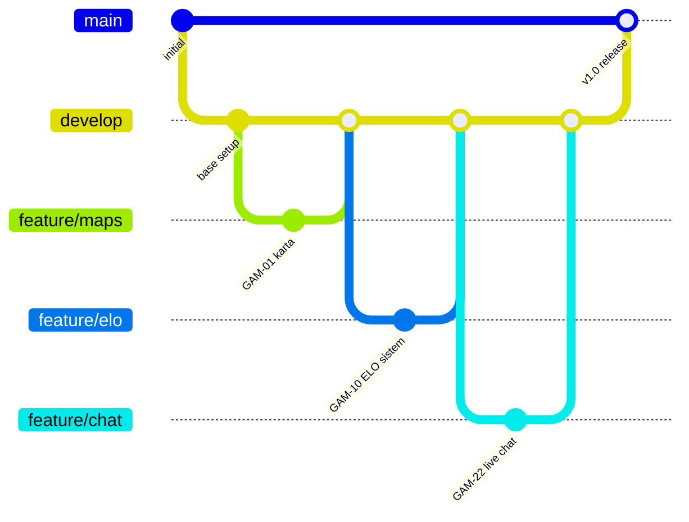

**Kako beremo diagram.** Vodoravne črte so veje, pike na njih pa commiti. Veja `main` vsebuje samo izdane različice, dnevni razvoj poteka na `develop`. Vsaka funkcionalnost dobi svojo vejo iz `develop` in se vanjo vrne prek pull requesta — tako `develop` ostane sestavljiv, tudi če je posamezna funkcionalnost še nedokončana. Združitev v `main` pomeni izdajo.

### Konvencija poimenovanja vej in commitov

- **Veje**: `feature/GAM-XX-kratek-opis`, `fix/GAM-XX-opis`, `hotfix/opis`
- **Commiti**: `GAM-XX Kratki opis spremembe` (npr. `GAM-22 Live chat z slikami in gifi`)
- **Pull requesti**: Vsaka feature veja se mergea prek PR z vsaj enim reviewerjem

### Razvojni tok

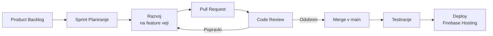

**Kako beremo diagram.** Diagram prikazuje pot ene spremembe od naloge do izdaje. Bistvena točka je pregled kode (code review): sprememba se v `develop` ne združi neposredno, temveč prek pull requesta, ki ga pregleda drug član ekipe. Če pregled zahteva popravke, se pot vrne na razvoj — od tod povratna zanka.

---

## Zagotavljanje kakovosti

### Odločitveni tok varnostnih pravil

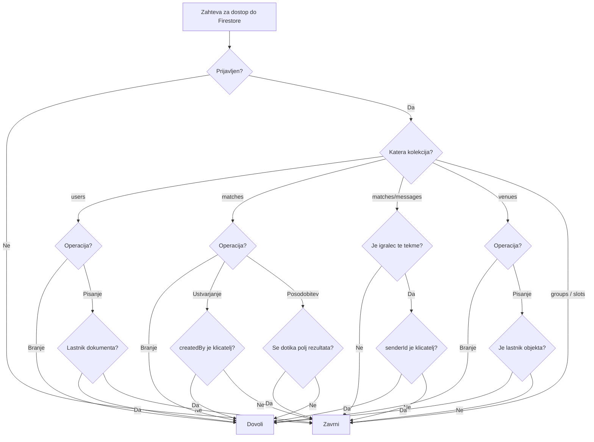

**Kako beremo diagram.** Diagram prikazuje vrstni red preverjanj, ki jih Firestore opravi ob vsaki zahtevi. Prvo vprašanje je vedno avtentikacija, nato pa se pot razveji po kolekciji. Dve mesti sta posebej pomembni: pri posodobitvi tekme se preveri, ali zahteva spreminja katero od zaklenjenih polj rezultata — če da, je zavrnjena ne glede na to, kdo jo pošilja. Pri klepetu se poleg članstva preveri še, da si pošiljatelj ne more pripisati tuje identitete.

Skrajno desna veja pojasnjuje najdbo iz razdelka o pomanjkljivostih: za `groups` in `slots` ni nobenega pravila, zato zahteva pade v privzeto zavrnitev. **Cloud Functions v tem diagramu ni** — admin SDK varnostna pravila v celoti obide, zato zanj ta pot ne velja.

### Preverjanje tipov

- Spletna aplikacija je v celoti v **TypeScriptu** (stroga tipizacija z `strict: true`)
- Definirani vmesniki za vse podatkovne modele v [web/src/types/models.ts](web/src/types/models.ts)
- Mobilna aplikacija je prav tako v TypeScriptu; `npx tsc --noEmit` se izvaja pred objavo

### Testiranje

| Vrsta | Pristop |
|-------|---------|
| Ročno testiranje | Testiranje na fizičnih napravah (Android) |
| Enotski testi | Jest + `@testing-library/react-native` (`src/**/__tests__/`) |
| Firestore pravila | Firebase Emulator Suite |
| Plačilni tok | Stripe test način (test kartice) |
| Notifikacije | Expo test orodje za push |

### Obravnava napak

- **Plačila**: preverjanje Stripe Checkout seje pred ustvarjanjem rezervacije
- **Omrežje**: vgrajeno delovanje brez povezave prek predpomnilnika Firestore
- **Rezultat tekme**: Cloud Function ob neveljavnem vnosu vrne `invalid-argument`, ob poskusu vnosa s strani nekapetana pa `permission-denied`
- **Varnost**: varnostna pravila kot zadnja obrambna linija pred nepooblaščenim dostopom

---

## Varnostna pravila

### Vloge v sistemu

Vloge niso zapisane kot polje v bazi (razen `role` pri lastnikih objektov) — izhajajo iz tega, kje se uporabnikov `uid` pojavi v dokumentu tekme. Zato jih varnostna pravila in Cloud Functions preverjajo sproti.

| Vloga | Kako je določena | Kaj sme |
|---|---|---|
| **Igralec** | `uid` je v `matches.players` | Prijava/odjava, klepet, označitev prisotnosti, vnos rezultata ob sporu |
| **Gostitelj** | `matches.createdBy == uid` | Ureja ekipi, vabi igralce, začne tekmo, briše tekmo |
| **Kapetan** | `matches.captainA` ali `captainB` | Vnese končni rezultat; določi ga sistem (najvišji ELO v ekipi), ne človek |
| **Lastnik objekta** | `venues.ownerId == uid` | Upravlja objekt, urnik in cenik; bere svoje rezervacije |
| **Administrator** | Firebase konzola | Poln dostop mimo pravil |

### Pregled pravil po kolekcijah

| Pot | Branje | Pisanje |
|---|---|---|
| `users/{uid}` | vsak prijavljen | samo lastnik računa |
| `users/{uid}/{podkolekcija}` | samo lastnik | samo lastnik |
| `matches/{id}` | vsak prijavljen | vsak prijavljen, **razen zaklenjenih polj rezultata** |
| `matches/{id}/messages/{id}` | samo igralci te tekme | samo igralci te tekme, `senderId` mora ustrezati prijavljenemu |
| `venues/{id}` | javno | samo lastnik objekta |
| `venues/{id}/schedule/{id}` | javno | samo lastnik objekta |
| `reservations/{id}` | rezervator ali lastnik | ustvari vsak prijavljen; posodobi rezervator ali lastnik |
| `groups`, `slots` | **ni pravila — vse zavrnjeno** | **ni pravila — vse zavrnjeno** |

### Zaklep rezultata tekme

Najpomembnejše pravilo preprečuje, da bi si igralec sam razdelil ELO:

```
allow update: if request.auth != null
  && !request.resource.data.diff(resource.data).affectedKeys()
       .hasAny(['scoreA', 'scoreB', 'finalized', 'result',
                'captainA', 'captainB',
                'scoreSubmissions', 'scorePhase', 'scoreDisputed']);
```

Odjemalec sme spreminjati dokument tekme (prijave, ekipi, prisotnost), ne sme pa se dotakniti nobenega od naštetih polj. Ta smejo nastati samo prek Cloud Functions `submitMatchScore` in `assignCaptains`, ki uporabljata admin SDK in zato varnostna pravila obideta. Brez tega zaklepa bi zadostoval spremenjen odjemalec, ki bi zapisal `finalized: true` s poljubnim rezultatom.

Zakaj branje uporabniških profilov ni omejeno na lastnika: aplikacija mora prikazati imena in ELO soigralcev, uravnotežiti ekipi in poiskati igralce za povabilo. Vse to so poizvedbe čez tuje dokumente, zato je branje odprto vsem prijavljenim, pisanje pa ostaja pri lastniku.

### Znane varnostne pomanjkljivosti

Pri pregledu trenutnih pravil so bile najdene naslednje slabosti. Navedene so odkrito, ker vplivajo na oceno zaupanja v sistem.

| # | Pomanjkljivost | Posledica | Resnost |
|---|---|---|---|
| 1 | `users/{uid}` dovoli lastniku pisanje **vseh** polj | Uporabnik lahko s poljubnim odjemalcem svojemu dokumentu nastavi `elo: 9999`, `wins`, `reputation` ali odklene vse značke. Premik izračuna ELO na strežnik je s tem obidljiv. | **visoka** |
| 2 | `matches/{id}` dovoli posodobitev **vsakemu** prijavljenemu | Kdor koli lahko na tuji tekmi spremeni `players` (izbriše soigralca), `attended` (komu odvzame ELO), `datetime`, `totalSpots` ali `matchStarted`. | **visoka** |
| 3 | `groups` in `slots` nimata pravila | Ponavljajoče se skupine in RSVP termini v produkciji ne delujejo — vsi klici vrnejo *permission denied*. | funkcionalna okvara |
| 4 | `reservations` dovoli ustvarjanje brez preverjanja | Rezervacijo je mogoče ustvariti s poljubno `price` (tudi 0) ali v imenu drugega uporabnika (`bookedBy` ni preverjen). | srednja |
| 5 | `users` je berljiv vsem prijavljenim, vključno z `email` in `expoPushToken` | Razkritje e-pošte vseh uporabnikov in žetonov za potisna obvestila. | srednja |
| 6 | Za Firebase Storage ni pravil v repozitoriju | Slike v klepetu se nalagajo v `chat-media/`, dostop pa določa nastavitev v konzoli, ki ni pod nadzorom različic. | neznana |
| 7 | `messages` nima omejitve velikosti ali pogostosti | Igralec tekme lahko klepet zapolni s poljubno dolgimi sporočili. | nizka |

**Priporočen vrstni red popravkov.** Najprej 1 in 2, ker neposredno razvrednotita ELO in reputacijo, torej osrednji mehanizem platforme. Pravilo za `users` naj dovoli pisanje samo polj, ki jih uporabnik res ureja (`displayName`, `position`, `expoPushToken`, `selectedBadge`), vse ostalo pa prepusti Cloud Functions — enako, kot je že urejeno pri tekmah. Pravilo za `matches` naj posodobitev omeji na gostitelja in na igralce, ki spreminjajo le polja, povezana s svojo udeležbo.

---

## Projektna ekipa

**Firebase projekt ID**: `gameon-9d876`  
**Android package**: `com.RISacc.gameontest`  
**Repozitorij**: [github.com/ninolisjak/gameon_projekt](https://github.com/ninolisjak/gameon_projekt)
