# GameOn — Projektna Dokumentacija

> **GameOn** je platforma za organizacijo in upravljanje rekreativnih športnih tekem (futsal, košarka) v Sloveniji. Sestavljena je iz mobilne aplikacije za igralce ter spletne aplikacije za lastnike športnih objektov.

---

## Kazalo

1. [Opis projekta](#opis-projekta)
2. [Arhitektura sistema](#arhitektura-sistema)
3. [Tehnološki sklad](#tehnološki-sklad)
4. [Podatkovni modeli — ER diagram](#podatkovni-modeli--er-diagram)
5. [Razredni diagram](#razredni-diagram)
6. [Diagram primerov uporabe](#diagram-primerov-uporabe)
7. [Diagram toka podatkov (DFD)](#diagram-toka-podatkov-dfd)
8. [Sekvenčni diagrami](#sekvenčni-diagrami)
9. [Navigacijska struktura](#navigacijska-struktura)
10. [Ključne funkcionalnosti](#ključne-funkcionalnosti)
11. [Navodila za zagon](#navodila-za-zagon)
12. [Vodenje projekta](#vodenje-projekta)
13. [Zagotavljanje kakovosti](#zagotavljanje-kakovosti)
14. [Varnostna pravila](#varnostna-pravila)

---

## Opis projekta

GameOn je hibridna platforma, ki rešuje dve ključni težavi rekreativnih športnikov:

1. **Iskanje in organizacija tekem** — Igralci s pomočjo mobilne aplikacije na karti odkrijejo bližnje tekme, se jim pridružijo, organizirajo ekipe in komunicirajo med seboj.
2. **Upravljanje športnih objektov** — Lastniki dvoran in igrišč s spletnim vmesnikom upravljajo razporede, sprejemajo rezervacije in sledijo prihodkom.

### Ciljni uporabniki

| Tip | Platforma | Vloga |
|-----|-----------|-------|
| Igralec | Mobilna aplikacija (Android) | Išče, ustvarja in se pridružuje tekmam |
| Lastnik objekta | Spletna aplikacija | Upravlja prostore, razporede in rezervacije |
| Administrator | Firebase konzola | Nadzoruje sistem |

---

## Arhitektura sistema

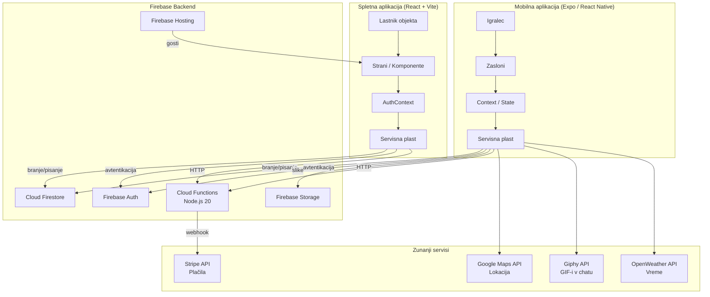

### Opis arhitekturnih plasti

| Plast | Opis |
|-------|------|
| **Prezentacijska plast** | React Native zasloni (mobilno) in React strani (spletno) |
| **Kontekstna plast** | React Context za globalno stanje (auth, premium, owner profil) |
| **Servisna plast** | Funkcije za komunikacijo s Firestore, Storage in Cloud Functions |
| **Podatkovna plast** | Cloud Firestore (NoSQL), Firebase Storage (datoteke) |
| **Funkcijska plast** | Cloud Functions za Stripe plačila (serverless) |

---

## Tehnološki sklad

### Mobilna aplikacija

| Tehnologija | Verzija | Namen |
|-------------|---------|-------|
| React Native | 0.74.5 | UI framework |
| Expo | ~51.0.28 | Build ogrodje |
| React Navigation | 6.x | Navigacija (Drawer + Stack) |
| Firebase SDK | 10.13.1 | Backend integracija |
| Stripe React Native | 0.37.2 | Plačila |
| react-native-maps | — | Prikaz karte |
| expo-location | — | GPS lokacija |
| expo-notifications | — | Push obvestila |
| expo-image-picker | — | Nalaganje slik |

### Spletna aplikacija

| Tehnologija | Verzija | Namen |
|-------------|---------|-------|
| React | 18.3.1 | UI framework |
| TypeScript | 5.6.2 | Tipizacija |
| Vite | 5.4.8 | Build orodje |
| React Router DOM | 6.26.2 | Routing |
| Tailwind CSS | 3.4.13 | Stilizacija |
| Leaflet | — | Interaktivne karte |
| Firebase SDK | 11.1.0 | Backend integracija |

### Backend

| Tehnologija | Namen |
|-------------|-------|
| Firebase Authentication | Prijava/registracija (email + geslo) |
| Cloud Firestore | Glavna NoSQL baza podatkov |
| Firebase Storage | Shranjevanje slik in datotek |
| Cloud Functions (Node.js 20) | Serverless logika, Stripe integracija |
| Firebase Hosting | Gostovanje spletne aplikacije |
| Stripe | Plačilni prehod za rezervacije |

---

## Podatkovni modeli — ER diagram

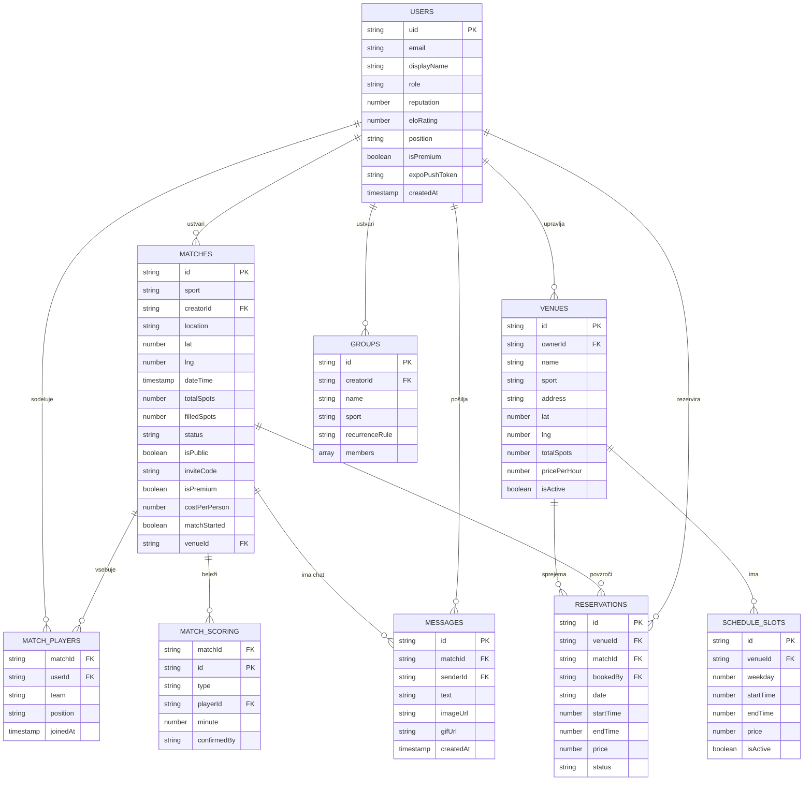

### Opis kolekcij v Firestore

| Kolekcija | Opis | Podkolekcije |
|-----------|------|--------------|
| `users` | Profili igralcev in lastnikov | `matchHistory`, `sentInvites` |
| `matches` | Tekme (aktivne, zaprte) | `players`, `scoring`, `messages` |
| `venues` | Športni objekti | `schedule` |
| `reservations` | Rezervacije objektov | — |
| `groups` | Ponavljajoče se ekipe | `events` |

---

## Razredni diagram

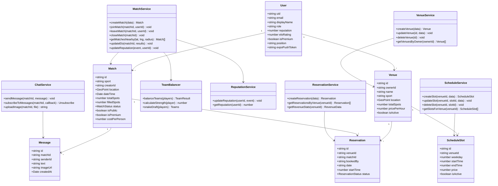

---

## Diagram primerov uporabe

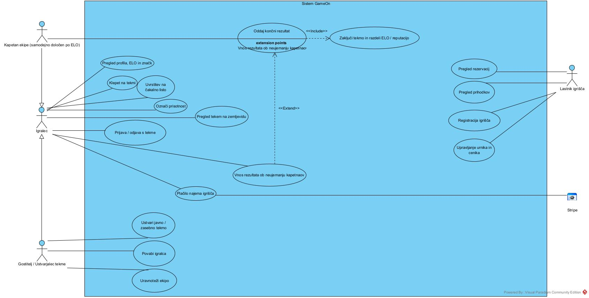

> Diagram je izdelan v **Visual Paradigm** (standardna UML notacija).
> Izvorni projekt za urejanje: [`docs/diagrami/projekt.vpp`](docs/diagrami/projekt.vpp) —
> po spremembi diagram znova izvozi kot sliko (*File → Export → Active Diagram as Image*).

**Branje diagrama**

| Element | Pomen |
|---|---|
| Palični lik | Akter (uporabnik ali zunanji sistem) |
| Oval | Primer uporabe |
| Modri pravokotnik | Meja sistema |
| Polna črta brez puščice | Asociacija med akterjem in primerom uporabe |
| Puščica s praznim trikotnikom | Generalizacija akterja (kaže od specializiranega k splošnemu) |
| `<<Include>>` | Osnovni primer uporabe vedno vključuje drugega |
| `<<Extend>>` | Razširitev, ki se izvede le pod določenim pogojem |
| *extension points* | Točka v osnovnem primeru uporabe, kjer se razširitev vključi |

**Vloge**

- **Gostitelj / Ustvarjalec tekme** in **Kapetan ekipe** sta specializaciji **Igralca** — podedujeta vse njegove primere uporabe in dodata svoje.
- **Kapetan** ni ročna vloga: ob začetku tekme ga sistem samodejno dodeli igralcu z najvišjim ELO v vsaki ekipi (Cloud Function `assignCaptains`).
- **Stripe** je zunanji akter — sodeluje samo pri plačilu najema igrišča.

**Postopek zaključka tekme**

- *Oddaj končni rezultat* **vključuje** (`<<Include>>`) *Zaključi tekmo in razdeli ELO / reputacijo*: ko se rezultata obeh kapetanov ujemata, se tekma samodejno zapre in ELO ter reputacija se razdelita vsem prisotnim igralcem.
- *Vnos rezultata ob neujemanju kapetanov* **razširja** (`<<Extend>>`) oddajo rezultata: sproži se samo, če se kapetana ne strinjata, in je takrat na voljo vsem prijavljenim igralcem — velja rezultat večine.

---

## Diagram toka podatkov (DFD)

### Nivo 0 — Kontekstni diagram

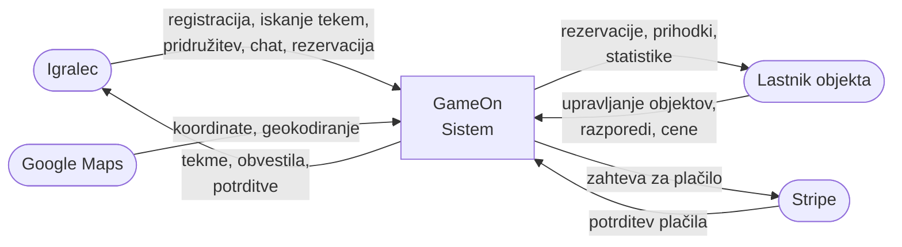

### Nivo 1 — Glavni procesi

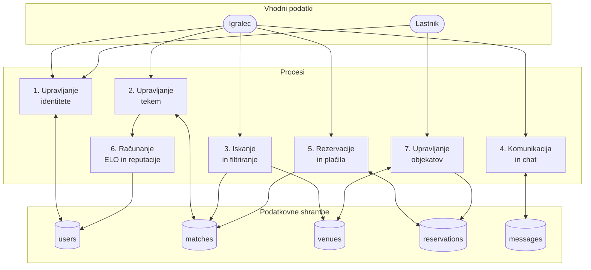

### Tok podatkov — Ustvarjanje tekme

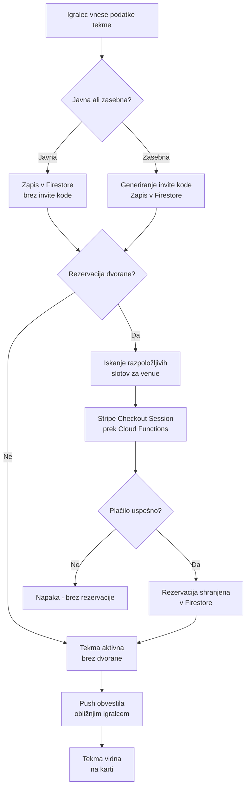

### Tok podatkov — Plačilo rezervacije

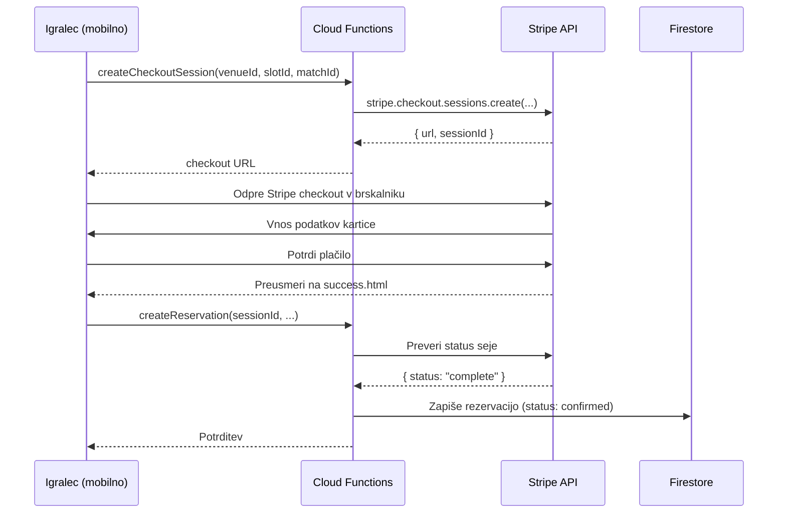

---

## Sekvenčni diagrami

### Pridružitev tekmi

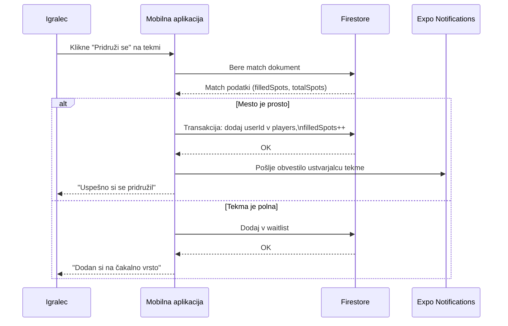

### ELO in reputacija po tekmi

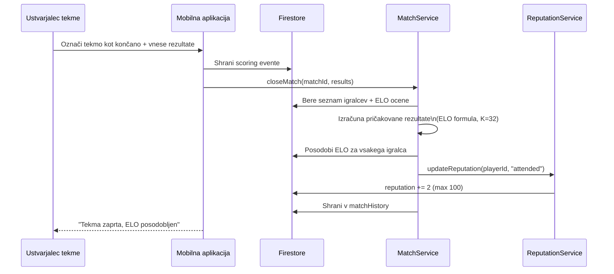

### Uravnoteženje ekip

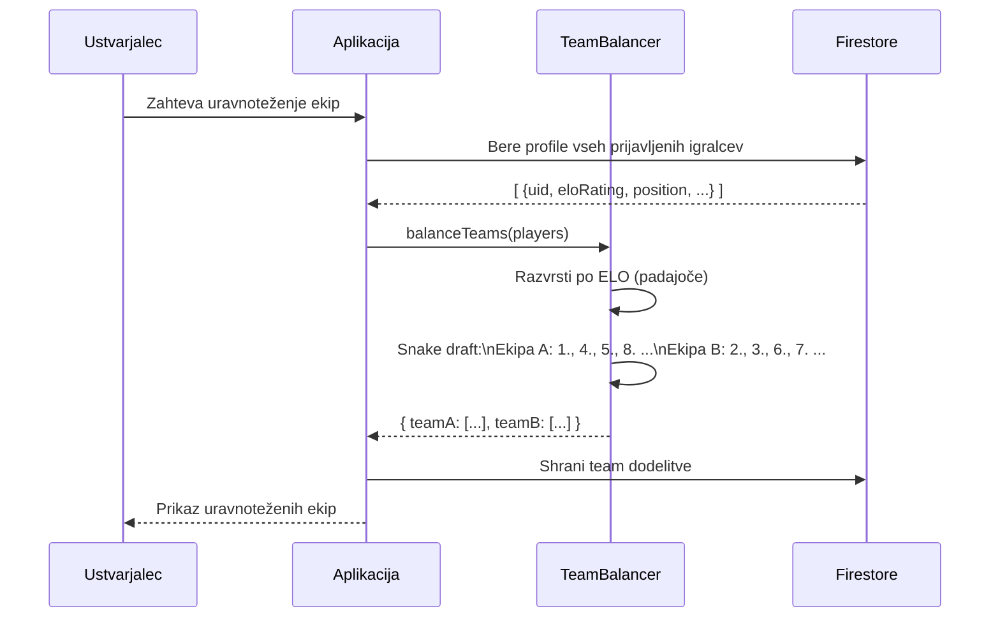

---

## Navigacijska struktura

### Mobilna aplikacija

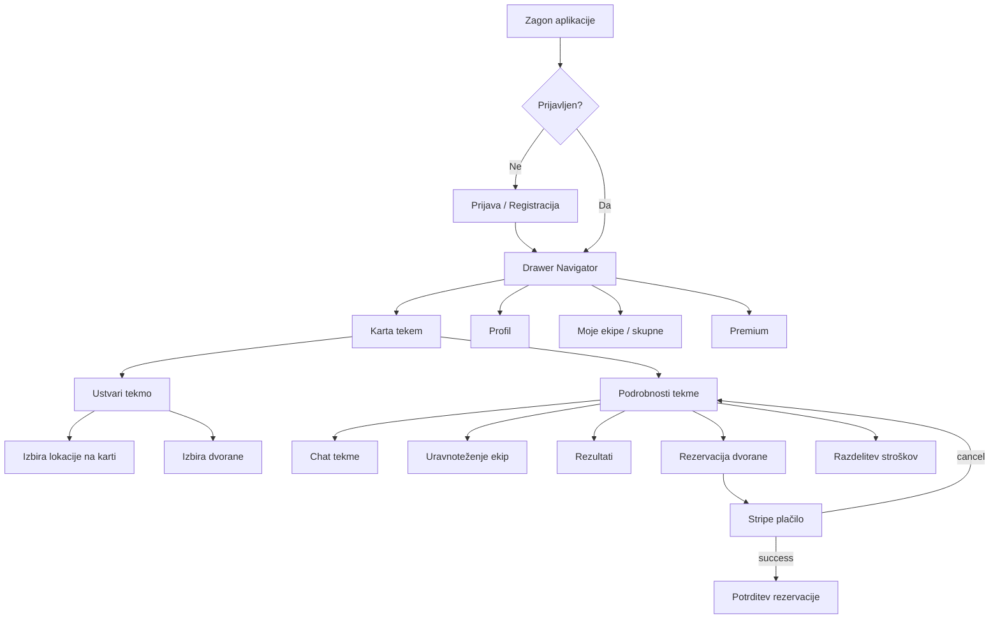

### Spletna aplikacija (lastnik objekta)

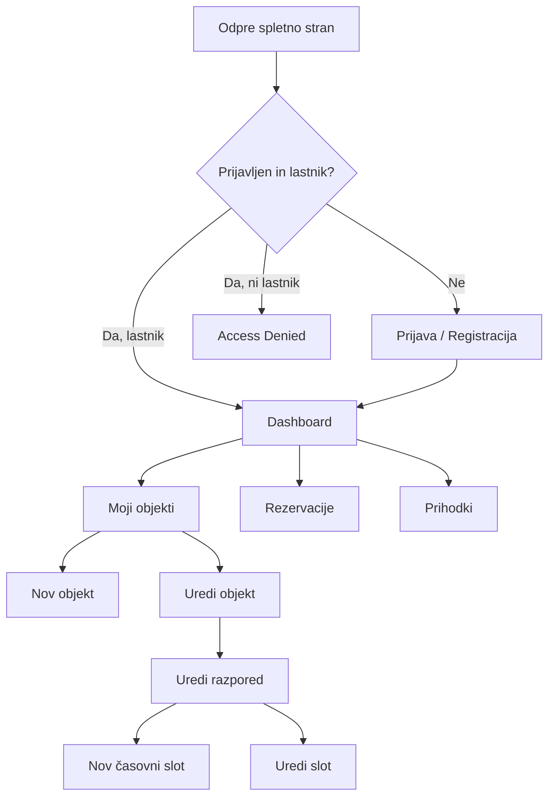

---

## Ključne funkcionalnosti

### 1. Sistem ELO ocenjevanja

Vsak igralec ima ELO oceno (začetna vrednost: **700**). Po vsaki tekmi se ocena posodobi po standardni ELO formuli:

```
E_A = 1 / (1 + 10^((ELO_B - ELO_A) / 400))
Nova_ELO = Stara_ELO + K * (dejanski_rezultat - pričakovani_rezultat)
K-faktor = 32
Bonus za gol = +5 ELO
```

### 2. Sistem reputacije

| Dogodek | Sprememba |
|---------|-----------|
| Udeležba na tekmi | +2 |
| Odjava pravočasno | 0 |
| Pozna odjava (< 2 uri pred tekmo) | -2 |
| Neupravičena odsotnost | -5 |

Reputacija je omejena med 0 in 100, začetna vrednost je **50**.

### 3. Uravnoteženje ekip (Snake Draft)

Algoritem razporedi igralce v dve enakovredni ekipi:
1. Razvrsti vse prijavljene po moči (ELO + pozicija)
2. Uporabi snake draft: A, B, B, A, A, B, B, A ...
3. Upošteva pozicije (vratar, branilec, vezni, napadalec / bek, center, krilo)

### 4. Premium tier

Premium člani imajo dostop do:
- Ekskluzivnih premium tekem
- Naprednih statistik (ELO trend, win rate)
- Premium badge na profilu
- Prednostnega dostopa do rezervacij

### 5. Živahni chat z medijsko vsebino

Vsaka tekma ima lasten chat kanal v realnem času (Firestore `onSnapshot`):
- Besedilna sporočila
- Slike (nalaganje v Firebase Storage)
- GIF-i (Giphy API integracija)

### 6. Integracija s Stripe

Plačila za rezervacije dvorane tečejo prek **Stripe Checkout**:
1. Cloud Function ustvari Stripe Checkout Session
2. Aplikacija odpre Stripe URL v brskalniku
3. Po uspešnem plačilu se aplikacija vrne na potrdilno stran
4. Rezervacija se potrdi v Firestore

---

## Navodila za zagon

### Predpogoji

- Node.js 20+
- Expo CLI: `npm install -g expo-cli`
- Firebase CLI: `npm install -g firebase-tools`
- Android Studio / Expo Go app (za mobilno)

### 1. Kloniranje repozitorija

```bash
git clone https://github.com/ninolisjak/gameon_projekt.git
cd gameon_projekt
```

### 2. Zagon mobilne aplikacije

```bash
cd mobile
npm install
npx expo start
```

Odprite Expo Go na telefonu in skenirajte QR kodo **ali** zaženite Android emulator.

### 3. Zagon spletne aplikacije

```bash
cd web
npm install
npm run dev
```

Dostopno na: `http://localhost:5173`

### 4. Zagon Cloud Functions (lokalno)

```bash
cd functions
npm install
firebase emulators:start
```

### Firebase konfiguracija

Ustvarite `mobile/src/config/firebase.ts` in `web/src/config/firebase.ts` z Firebase konfiguracijskimi podatki iz Firebase konzole:

```typescript
const firebaseConfig = {
  apiKey: "...",
  authDomain: "gameon-9d876.firebaseapp.com",
  projectId: "gameon-9d876",
  storageBucket: "gameon-9d876.appspot.com",
  messagingSenderId: "...",
  appId: "..."
};
```

---

## Vodenje projekta

### Struktura vej (Git Flow)

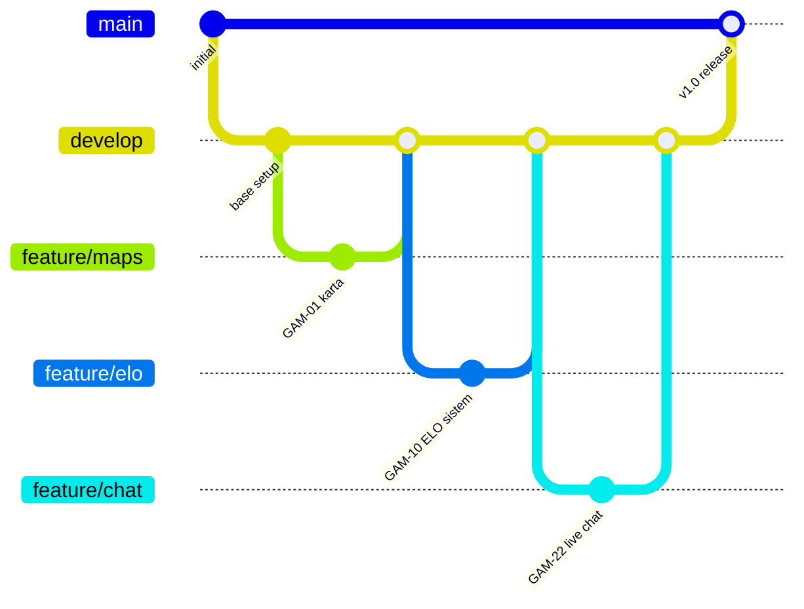

### Konvencija poimenovanja vej in commitov

- **Veje**: `feature/GAM-XX-kratek-opis`, `fix/GAM-XX-opis`, `hotfix/opis`
- **Commiti**: `GAM-XX Kratki opis spremembe` (npr. `GAM-22 Live chat z slikami in gifi`)
- **Pull requesti**: Vsaka feature veja se mergea prek PR z vsaj enim reviewerjem

### Razvojni tok

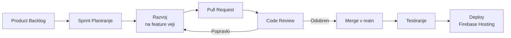

---

## Zagotavljanje kakovosti

### Varnostna pravila Firestore

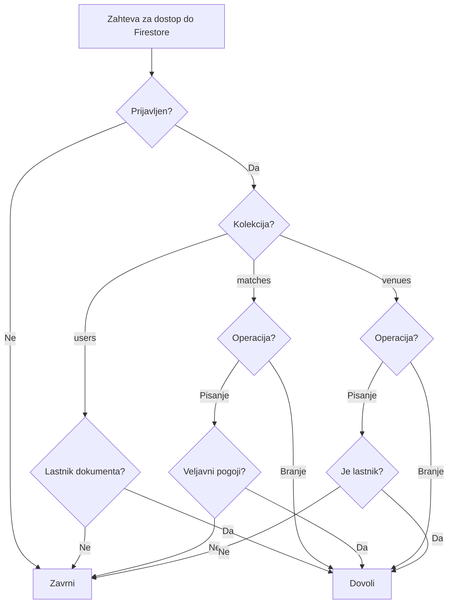

### Preverjanje tipov

- Spletna aplikacija je v celoti v **TypeScriptu** (stroga tipizacija z `strict: true`)
- Definirani vmesniki za vse podatkovne modele v [web/src/types/models.ts](web/src/types/models.ts)
- Mobilna aplikacija deloma tipizirana (JavaScript + JSDoc)

### Testiranje

| Vrsta | Pristop |
|-------|---------|
| Ročno testiranje | Testiranje na fizičnih napravah (Android) |
| Firestore pravila | Firebase Emulator Suite |
| Plačilni tok | Stripe test način (test kartice) |
| Notifikacije | Expo test orodje za push |

### Obravnava napak

- **Plačila**: Stripe Checkout Session verifikacija pred ustvarjanjem rezervacije
- **Omrežje**: Firebase SDK vgrajeno offline upravljanje (Firestore cache)
- **Varnost**: Firebase Security Rules kot zadnja obrambna linija pred nepooblaščenim dostopom

---

## Varnostna pravila

### Vloge v sistemu

| Vloga | Dostop |
|-------|--------|
| `player` | Mobilna aplikacija, tekme, chat, rezervacije |
| `owner` | Spletna aplikacija, upravljanje objektov |
| `admin` | Polni dostop prek Firebase konzole |

### Firestore Rules (povzetek)

| Kolekcija | Branje | Pisanje |
|-----------|--------|---------|
| `users` | Samo lastnik | Samo lastnik |
| `matches` | Vsi avtentificirani | Ustvarjalec + omejeno |
| `venues` | Vsi | Samo lastnik objekta |
| `schedule` | Vsi | Samo lastnik objekta |
| `reservations` | Rezervator ali lastnik | Udeleženci |

---

## Projektna ekipa

**Firebase projekt ID**: `gameon-9d876`  
**Android package**: `com.RISacc.gameontest`  
**Repozitorij**: [github.com/ninolisjak/gameon_projekt](https://github.com/ninolisjak/gameon_projekt)
